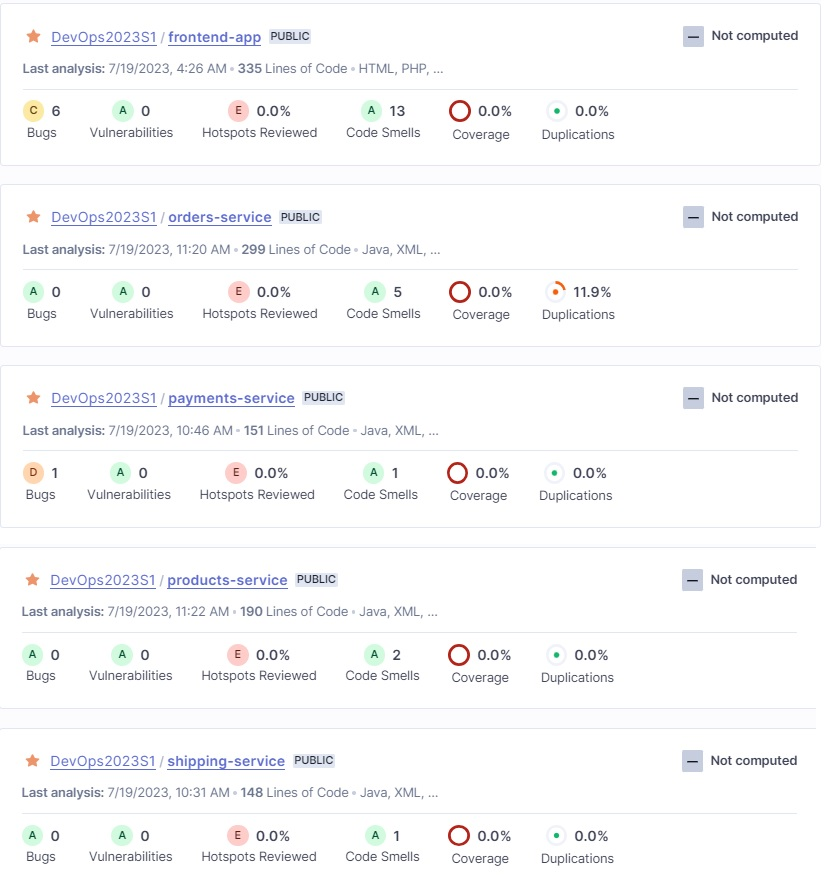

# Obligatorio DevOps - Julio 2023
#### Realizado por Adrián Rodríguez [241708] y Gastón Sanguinetti [187831]
---

## Descripción del problema
Una empresa existente en el mercado del sector retail, nos plantea el desafío de modernizar la forma en la que desarrollan y realizan el delivery del software de la plataforma que utilizan internamente. 
Para esto, surge la idea de implementar un modelo DevOps, que permita mejorar el fast time to market así como también, mejorar la calidad del código que desarrollan los colaboradores.

## Objetivo
Como equipo implementador de metodologías y herramientas DevOps, buscaremos implementar soluciones que permitan cubrir la descripción del problema que plantea la empresa, para lograr con los cometidos fundamentales:
- Mejorar el tiempo de salida al mercado (liberar versiones más rápidamente)
- Mejorar la calidad del código aplicando técnicas que permitan esto

Para poder cumplir estos objetivos, nos apoyaremos en herramientas que nos permitan, entre otras cosas:

- Generar infraestructura en un proveedor de Cloud (AWS) mediante herramientas de IaC
- Generar pipelines de CI que permitan la generación automática de nuevas versiones
- Generar pipelines de CD que permitan el despliegue controlado en distintos ambientes
- Dentro de cada pipeline, automatizar algunas tareas como por ejemplo: la ejecución de tests unitarios, smoke tests y análisis de código estático.
- Generar repositorios de código que sigan los lineamientos para el buen trabajo en equipo y siguiendo una estructura de ramas que garanticen el orden y la facilidad de implementar nuevas features/fixes.

---
## Git
Comenzaremos explicando el flujo de trabajo y estructura que tendrán los repositorios de código de Git.  

Para llevar adelante la propuesta, se optó por adoptar la estrategia de TrunkBase para el manejo de ramas.  
Los repositorios (siempre hablando de los de los microservicios/frontend y el de DevOps) tendrán siempre 2 ramas estables: develop y master.  
Cuando sea necesario realizar una nueva funcionalidad o realizar un fix, se deberá partir desde develop, creando una rama nueva con el prefijo "feature/" seguido con un nombre corto pero descriptivo de la funcionalidad/fix que se está implementando, por ejemplo: "feature/agregar-endpoint-pagos".  
Una vez que finaliza el desarrollo, se creará un Pull Request hacia develop, que deberá ser revisado por otra persona para realizar comentarios, o en caso de que todo esté bien, aprobar dicho Pull Request (PR).  
Una vez aprobado, el creador de la funcionalidad, deberá mergear ese PR a develop y luego, realizar otro PR desde develop hacia master para que master, quede con todos los cambios realizados ya probados.  
A continuación, mostramos un diagrama del flujo:  

---

## Microservicios
Uno de los pilares fundamentales para poder aplicar DevOps, es la arquitectura de microservicios.  
Para llevar adelante esta implementación, sugerimos a la empresa dejar de lado la arquitectura tradicional (es decir, el monolito) y comenzar el desarrollo de varios microservicios que en conjunto formen el sistema completo.  
Con esto, obtenemos un sistema mucho más escalable, con un código más fácil de mantener y además, se delegan las responsabilidades. Cada microservicio, es responsable de su "parte" del sistema.  
Otra ventaja de este tipo de arquitecturas, es que en caso de falla de uno de los microservicios, se vería afectada esa parte del sistema y no todo el aplicativo.  
A continuación, un diagrama de cómo queda esta arquitectura para el caso planteado:

## Infraestructura
Toda la infraestructura necesaria para alojar la aplicación se encuentra en Amazon Web Services (AWS).  
A su vez, todos los recursos necesarios para que la aplicación quede operativa y disponible, se generan con IaC utilizando diversos archivos de Terraform.  
Es posible crear 3 ambientes separados (test/dev/prod) simplemente eligiendo el archivo de variables.  
El uso de IaC, ahorra (horas) de implementación de futuros nuevos ambientes, así como también evita posibles errores humanos que puedan surgir a la hora de crear recursos manualmente haciendo muchos "clicks".

A modo de resumen, nuestros archivos de Terraform, disponibilizan por ejemplo, estos recursos: 
- Cluster que contiene los services (ECS) de los microservicios
- Services (ECS) para cada microservicio
- Balanceadores de carga para cada microservicio
- Repositorios de imágenes Docker (ECR)
- Grupos de seguridad (Security Groups)
- Buckets S3

## Flujo de trabajo para una nueva funcionalidad
Supongamos que un desarrollador quiere realizar una nueva funcionalidad en un microservicio o en la aplicación del frontend... Cómo sería el flujo de trabajo?  
  
Primeramente, el desarrollador generará una rama nueva con nombre feature/nueva-func partiendo de develop.  
Realizara toda la codificación y tests necesarios para implementar dicha funcionalidad.  
Terminado el proceso de desarrollo, abrirá un PR hacia develop.  
En este momento, un github-action estará escuchando los cambios en el repo y ante la apertura de un PR, disparará un llamado a Jenkins para ejecutar el pipeline de CI de ese servicio/app frontend.  
El pipeline de CI, se encargará a modo de resumen de compilar la aplicación, ejecutar los tests, generar la imagen de ese microservicio/app front, y subirá esa imagen creada al repositorio de imágenes para luego, poder ser desplegada en un ambiente. Esta imagen que se genere, será de tipo "test" la misma no podrá ser desplegada en los ambientes de producción. Podrá ser desplegada únicamente en ambiente de dev y test.  

En este momento, el desarrollador o el equipo QA, podrá ejecutar el pipeline de CD, para desplegar esa nueva versión en un ambiente de pruebas. 

Un vez que el PR sea aprobado y mergeado a master, se ejecutará otro github-action (que escucha únicamente los push a master) que ejecutará el mismo pipeline de CI, pero al final, se obtendrá una versión de tipo "release" que sí podrá ser desplegada en ambientes de producción.  

Nota: el flujo de los pipelines se detallará más adelante en este documento. 

A continuación, mostramos de forma más visual, el flujo comentado anteriormente: 

## Pipelines de Jenkins
Para los ciclos de CI/CD, se optó por utilizar Jenkins como herramienta para este fin.  
Para nuestro caso, se instaló el servidor Jenkins en una máquina virtual EC2, y se utiliza el mismo servidor Jenkins para el CI/CD de todos los ambientes (test/dev/prod).

A continuación, brindamos más información sobre los pipelines.  
### Pipelines de CI
Los pipelines de CI, serán los encargados de empaquetar una aplicación (microservicio o app de frontend) y dejarán creada (en caso de que el pipeline sea exitoso) la versión generada, ya sea en ECR o S3 (según si es microservicio o frontend).  
Esta versión generada podrá ser desplegada mediante el pipeline de CD.  
El pipeline de CI, va ejecutando diferentes pasos uno a uno siempre y finalizará cunado todos los pasos se hayan ejecutado de forma correcta, o se verá interrumpido si uno de los pasos falla.  
#### CI de microservicios
El pipeline de CI para la creación de versiones de microservicios, consta de las siguientes etapas:
  
Breve resumen de cada una: 
- Clone: Se clona el repositorio del microservicio en cuestión.
- Download dependencies: Se descargan las dependencias necesarias (con Maven) para luego hacer la compilación y build. 
- Build & Compile: se compila el codigo obtenido desde el repositorio.
- Run unit tests: se ejecutan los test unitarios escritos.
- Sonar Analysis: mediante la herramienta "Sonar Cloud" se hace un análisis estático del código para buscar posibles mejoras del mismo. 
- Build Docker image: se genera la imagen de Docker que luego se subirá al repositorio.
- Ejecutar test en Postman: se levanta la imagen creada en el paso anterior, y se ejecutan test desde una Postman Collection, para verificar que la imagen construida está correcta. 
- Push to AWS ECR Repository: se sube al repositorio de imágenes de AWS la imagen generada.

#### CI de frontend
El pipeline de CD para la creación de versiones del frontend, consta, en tanto, de las siguientes etapas:
  
Breve resumen de cada una: 
- Clone: Se clona el repositorio de la app de frontend.
- Build & Compile: se hace el build de la aplicación con Node. 
- Sonar Analysis: mediante la herramienta "Sonar Cloud" se hace un análisis estático del código para buscar posibles mejoras del mismo.
- Subiendo a S3 Bucket: se sube la app buildeada al repositorio de imágenes de front que se encuentra en un bucket S3. 

### Pipelines de CD
Los pipelines de CD, serán los encargados de desplegar las versiones generadas mediante el pipeline de CI ya sea de los microservicios o de la app de frontend.  

Del mismo modo que ocurre con el pipeline de CI, este va ejecutando una serie de pasos, y finalizará cuando todos terminen o se verá interrumpido de forma inmediata si uno de los pasos falla.  

Algo importante a destacar y a tener en cuenta es que, en el ambiente de producción solo se podrán desplegar imágenes de tipo "release-X". Es decir, las que se construyen con el Github-Action de push a master.  
Adicional a esto, solo se listarán como posibles opciones a desplegar, las última 5 versiones generadas, para evitar que por accidente, se despliegue una versión muy vieja del aplicativo y que esto genere consecuencias negativas.  
En ambientes de test y dev, no existe esta limitante, y puede desplegarse cualquier versión (test o release) a demanda sin impedimentos.  

Lo anteriormente descrito, sucede para los microservicios y para la app de frontend. 

#### CD de microservicios
Al iniciar el pipeline, se solicitará que se seleccione cuál servicio se desea desplegar:  
  

Una vez seleccionado el microservicio a desplegar, seguirán las siguientes etapas:  
  

Breve detalle de cada etapa:  
- Seleccionar tipo de ambiente: se muestra un combo box, para seleccionar el ambiente: dev, test o producción
- Obtener imágenes disponibles: de acuerdo a la selección del paso anterior, se obtendrá desde el repositorio, la lista de imágenes posibles a desplegar para ser mostradas en el siguiente paso.
- Seleccionar imagen y desplegar: se muestra un combo box, con la lista de imágenes que pueden ser desplegadas obtenidas del paso anterior. Una vez seleccionada, se continua con la siguiente etapa.
- Crear task-definition: crea la task definition necesaria para actualizar luego el service ECS.
- Actualizar service ECS: usando la task definition creada en el paso anterior, actualiza el servicio con esa nueva task. 

Luego de unos minutos, el servicio de ECS, dejará disponible la nueva versión.  

#### CD de frontend
El pipeline de CD de la app de frontend, funciona de una forma muy similar al de los microservicios.  

  

Breve detalle de cada etapa:  
- Seleccionar tipo de ambiente: se muestra un combo box, para seleccionar el ambiente: dev, test o producción
- Obtener imágenes disponibles: de acuerdo a la selección del paso anterior, se obtendrá desde el repositorio, la lista de imágenes posibles a desplegar para ser mostradas en el siguiente paso.
- Seleccionar imagen y desplegar: se muestra un combo box, con la lista de imágenes que pueden ser desplegadas obtenidas del paso anterior. Una vez seleccionada, se continua con la siguiente etapa.
- Crear Descargar desde Repo S3: obtiene localmente la version alojada en el repo de S3 para subirla al bucket correspondiente en el siguiente paso.
- Subir a S3: sube al repositorio correspondiente la nueva versión. 

## Test de aplicaciones
Una de las tantas ventajas que ofrece uso de ciclos de CI, es garantizar la calidad del código y la integridad de la imagen que se construirá.  
Como mostramos en el apartado de "Pipelines de CI", se puede observar que se ejecutan diversos tests a las aplicaciones de microservicios.  
Vamos a detallar cada uno de ellos, en el orden en el que se ejecutan en el pipeline.

#### Test unitarios (o unit tests):
Los test unitarios o unit tests, son una forma de probar que cierto bloque de código (una función específica por ejemplo), funciona de la forma que se espera.  
Los test unitarios, son escritos por los desarrolladores y, en líneas generales, se compara el resultado que se espera obtener, con el que se obtiene en la ejecución de ese bloque de código. Si esa comparación es correcta, entonces el test pasó la prueba. Si la comparación no sea correcta, el test no pasa la prueba y esto indica un error.  
En el caso del pipeline de CI, se detendría ante la ejecución errónea de un test unitario y no se crearía la versión.  
El desarrollador, deberá corregir el test o la funcionalidad, para que el mismo se ejecute de forma correcta. 

#### Análisis de código estatico:
Para este tipo de análisis o comprobaciones, se pueden utilizar diversas herramientas.  
En este caso, optamos por Sonar Cloud.  
En líneas generales, las herramientas de código estático, analizan el código fuente de una aplicación (es decir, el código "crudo", sin compilar) ejecutando una serie de pruebas que permiten por ejemplo, detectar errores en la codificación, encontrar posibles vulnerabilidades, fugas de memoria, etc.  
Estas herramientas, generan un reporte mostrando cuáles puntos son los que deben o pueden ser mejorados en el código.  

Si accedemos a la herramienta SonarCloud, vemos un dashboard en donde vemos un resumen de todas las aplicaciones:  

  

Como se puede observar, Sonar advierte de algunos puntos de mejora: 
- Code Smells (o sea, algunas estructuras o funciones que podrían ser mejoradas, eventualmente con algún de refactor en el código)
- La app de frontend y el microservicio de payments advierten algunos posibles bugs
- Todas las aplicaciones tienen un 0% de coverage (es decir, no hay test unitarios). 
- Existen líneas de código duplicadas

Algunos puntos que proponemos para mejorar la calidad de las aplicaciones, siguiendo los informes que se ven en Sonar son: 
- Realizar de forma urgente tests unitarios que prueben el código. 
- Revisar las vulnerabilidades reportadas por Sonar y priorizarlas para ver cuales hay que resolver de forma urgente. 
- Dentro de lo posible, hacer un código limpio y prolijo, que reutilice código ya hecho para evitar duplicaciones y funciones innecesarias. 

#### Smoke Tests, o tests funcionales básicos
Son pruebas funcionales básicas, que nos indican que, a priori, la version generada no afecta funcionalidades básicas que ya existen en la aplicación.  

Para este caso, propusimos realizar tests automatizados con colecciones de Postman para cada servicio.  
En la colección, generamos un test básico, realizará la operación basica de la aplicación, esperando que el resultado sea 200 (es decir HTTP OK).  
Si el resultado no fuera 200 (por ejemplo se obtiene un 500, 4xx, etc) asumiremos que algo está mal en la versión generada y el pipeline no seguirá adelante , marcando el error.  

Estas pruebas se ejecutan en el paso "Ejecutar test en postman".  
Durante la ejecución del pipeline, puede verse el estado de estas pruebas en los logs del mismo.  

Ejemplo para el servicio de productos:  
  

Como se aprecia en la imagen, primeramente se levanta un contenedor en Docker con la versión generada.  
Luego se ejecutan los tests de la colección de (Postman) utilizando "newman" como herramienta para ello. 
Se ve en pantalla el resultado del test, en este caso, se esperaba un 200, y ese fue el resultado, por lo que el pipeline sigue su curso.  
Al final, se detiene el contenedor iniciado.